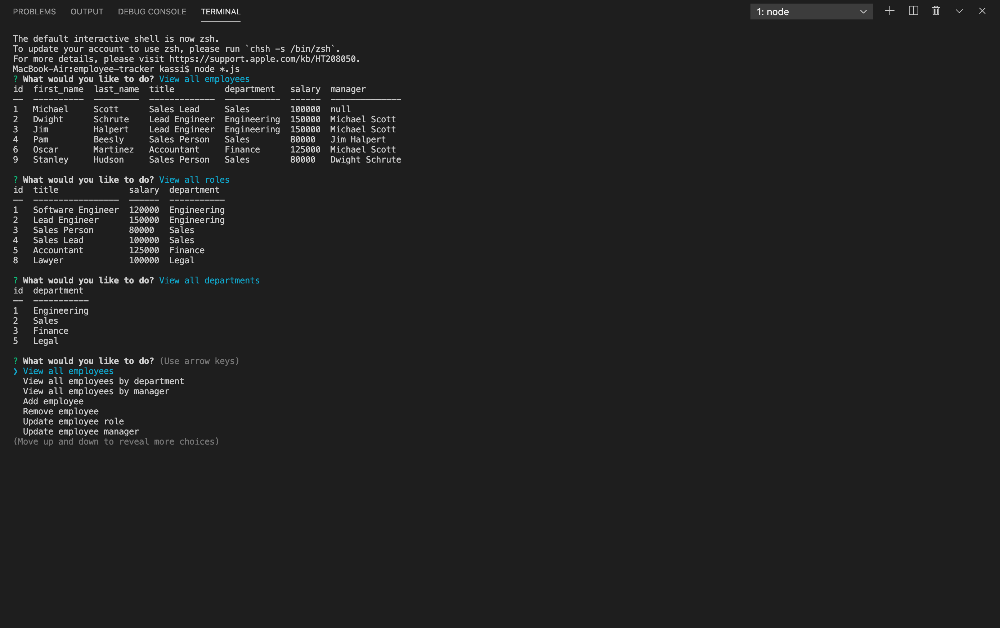

  # Welcome to employee-tracker! 0.1.0
  

  ## Description

  A Node CLI to manage your company's employee information.

  Technologies used
  * node.js
  * package.json
  * constructors and classes
  * inquirer npm package
  * MySQL
  * Async/Await

  ### Demo

  <figure class="video_container">
    <iframe src="https://drive.google.com/file/d/1SrXI82YM5BYEojznyhWBg6uHaLHhCJA-/preview" frameborder="0" allowfullscreen="true"> </iframe>
  </figure>

  ## Table of Contents

  * [Installation](#installation)
  * [Usage](#usage)
  * [License](#license)
  
  ## Installation

  Clone the repo to your local machine using `git@github.com:kassimariemc/employee-tracker.git` Then `$ npm install`

  ## Usage

  Just run the following command at the root of the cloned file and begin building your team's information.  `$ node *.js`     The CLI will keep up with your updates in a database that you can always return to. 

  ## License

  Copyright &#169; 2020 [@kassimariemc](https://github.com/kassimariemc). 
  This project is [MIT](https://choosealicense.com/licenses/mit/) licensed.
  

  _____________________________________________________
  > *This README was generated with &hearts; by [readme-generator](https://github.com/kassimariemc/README-generator)*
